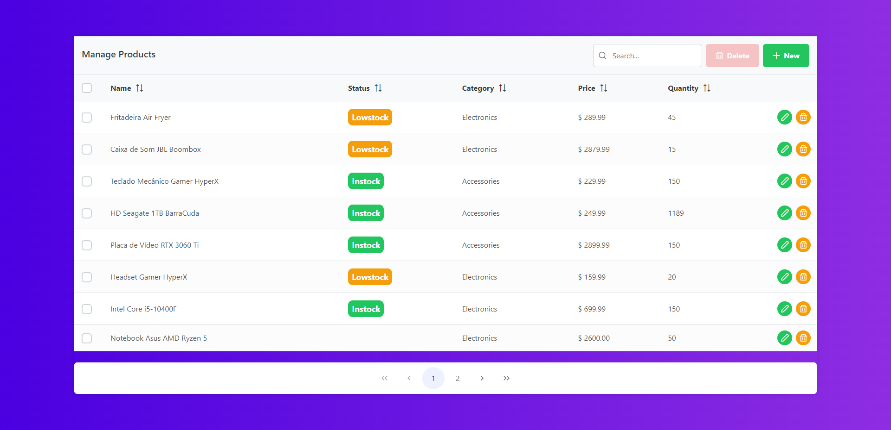

# Manage Products - Client

This project is the [Manage Products](https://github.com/Gildasio-Abraao/Inventory-Manager-Server) client-side, but you can also use it for other purposes. It's still in development but I'm always updating improving the code. You can follow me developing this project on my [Linkedin](https://www.linkedin.com/in/gildasioabraao/)

## Project setup
```
npm install
```

### Compiles and hot-reloads for development
```
npm run serve
```

### Compiles and minifies for production
```
npm run build
```

### Lints and fixes files
```
npm run lint
```

### Customize configuration
See [Configuration Reference](https://cli.vuejs.org/config/).

## Screenshots



## Libs

We use some libs like [Primevue](https://primevue.org/) and [Bootstrap](https://getbootstrap.com/).
